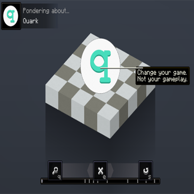

<h1 align="center">Quark Ponders</h1>
<h3 align="center">Pondering about the quarks.</h3> 
 

<h4 align="center"><b>This is an addon for quark that brings the ponder mechanics from Create to the features in quark, explaining how many of them work with in game examples and explanation.</b></h4>
